<!DOCTYPE html>
<html lang="en">
<head>
<meta charset="UTF-8">
<meta name="viewport" content="width=device-width, initial-scale=1.0">
<title>8-bit Left Shift Register</title>

</head>
<body>

<!-- COVER -->

  <h1>8-bit Left Shift Register</h1>
  
<strong>ED221:</strong> Digital IC Design Tape in &amp; Tape out Lab

   
  
<em>CMOS Implementation of an 8-Bit Left Shift Register in Cadence</em>

   
  

    Mansi Mangukiya - 202404021 
    Rashi Krishnani - 202404018 
    Yash Judal - 202404014
  

   
  
<strong>Supervised By:</strong> Biswajit Mishra

<!-- CONTENTS -->
<h2>Contents</h2>

  <ol>
    <li>Introduction</li>
    <li>Circuit Schematic</li>
    <li>Pin Configuration</li>
    <li>Delays of Components used</li>
    <li>Power Characteristics (DATA = 11111111)</li>
    <li>Calculations</li>
    <li>Functional Description
      <ol>
        <li>SIPO</li><li>PISO</li><li>MUX</li><li>AND</li>
      </ol>
    </li>
    <li>Working</li>
    <li>Example stimulation of 7 - Bit Left Shift of 11111111</li>
    <li>LAYOUT</li>
    <li>AREA ANALYSIS</li>
    <li>POST LAYOUT &amp; PRE LAYOUT COMPARISION</li>
  </ol>

<!-- 1 -->
<h2>1 | Introduction</h2>

The 8-bit Left Shift Register circuit is implemented using a combination of Parallel-In Serial-Out (PISO), Serial-In Serial-Out (SISO) registers, multiplexers, and logic gates to perform logical left-shift operations on 8-bit data. The design operates at a nominal supply voltage of 1.8V and is implemented and simulated in Cadence Virtuoso. The register supports synchronized clock-driven shifting, serial data transfer, and logical left-shift functionality.

<!-- 2 -->
<h2>2 | Circuit Schematic</h2>
<figure>
  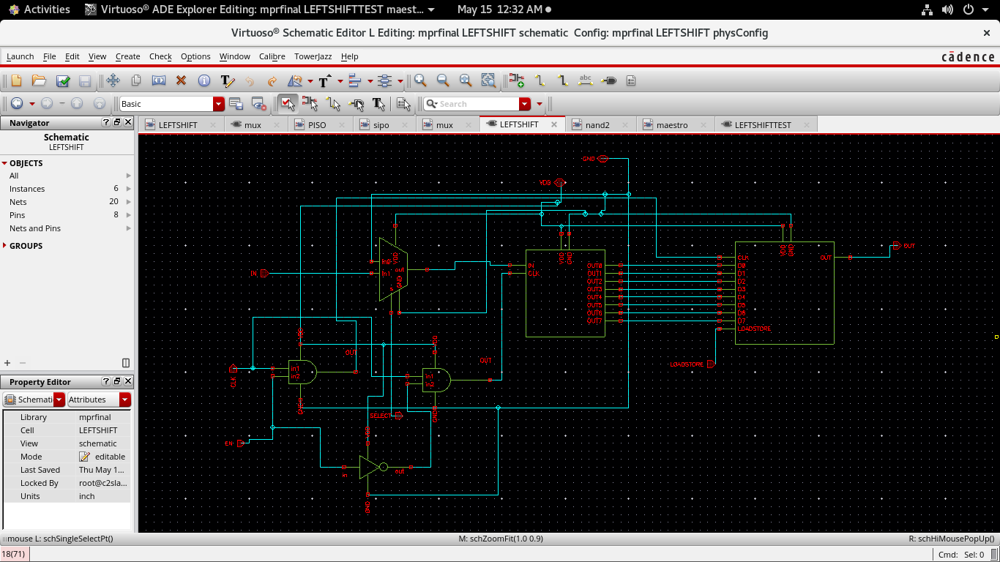
  <figcaption>8-bit Left Shift Register — Top-level Schematic (Cadence Virtuoso)</figcaption>
</figure>

<h3>SYMBOL</h3>
<figure>
  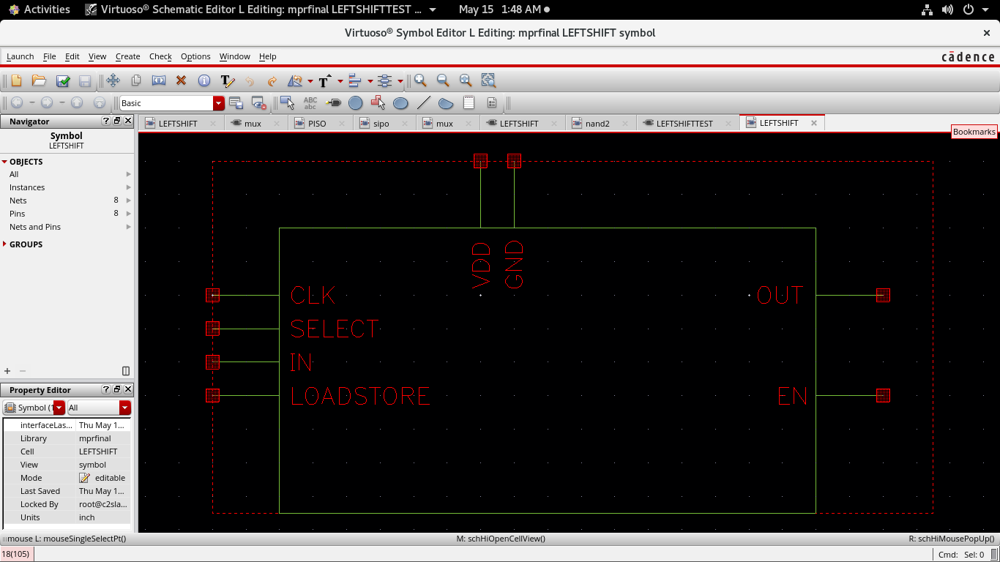
  <figcaption>LEFTSHIFT Symbol — CLK, SELECT, IN, LOADSTORE inputs; OUT, EN outputs</figcaption>
</figure>

<h3>PISO</h3>
<figure>
  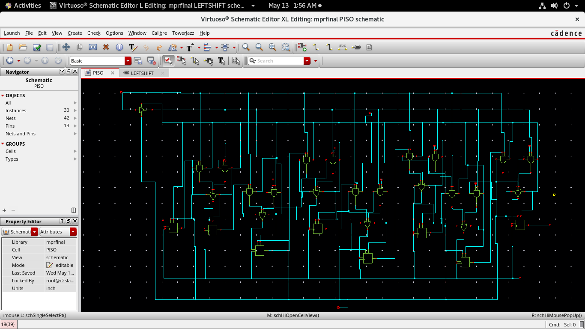
  <figcaption>PISO (Parallel-In Serial-Out) Schematic</figcaption>
</figure>

<h3>SIPO</h3>
<figure>
  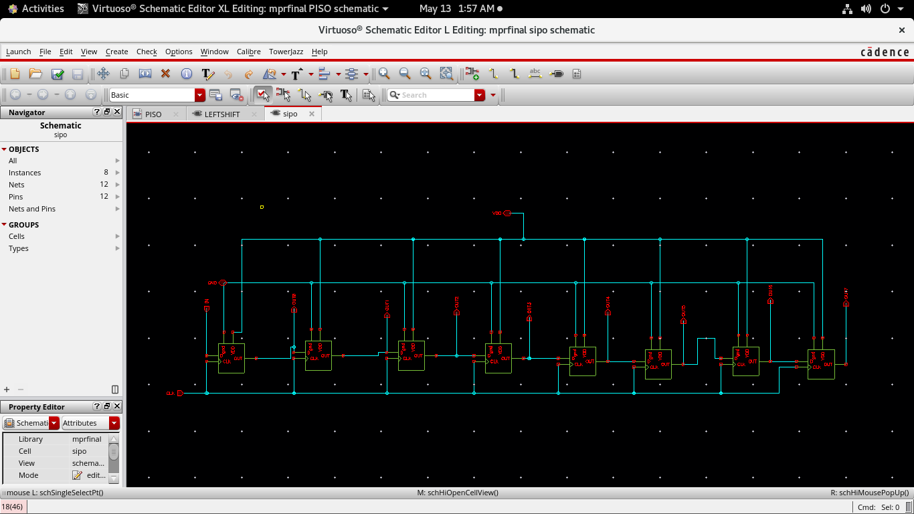
  <figcaption>SIPO (Serial-In Parallel-Out) Schematic</figcaption>
</figure>

<!-- 3 -->
<h2>3 | Pin Configuration</h2>
<table>
  <tr><th>Pin</th><th>Description</th></tr>
  <tr><td>VDD</td><td>Supply voltage (1.8V)</td></tr>
  <tr><td>GND</td><td>Ground (0V)</td></tr>
  <tr><td>CLK</td><td>Clock input</td></tr>
  <tr><td>IN</td><td>Serial data input (MSB first)</td></tr>
  <tr><td>LOADSTORE</td><td>Control signal for load/shift operation</td></tr>
  <tr><td>SELECT</td><td>Shift operation select input</td></tr>
  <tr><td>EN</td><td>Enable signal for clock operation</td></tr>
  <tr><td>OUT</td><td>Serial Output (MSB first)</td></tr>
</table>

<!-- 4 -->
<h2>4 | Delays of Components used</h2>
<table>
  <tr><th>Components</th><th>Delay</th></tr>
  <tr><td>AND Gate</td><td>227.7 ps</td></tr>
  <tr><td>OR Gate</td><td>174.05 ps</td></tr>
  <tr><td>MUX</td><td>189.72 ps</td></tr>
  <tr><td>LATCH</td><td>428.395 ps</td></tr>
  <tr><td>D Flip-Flop</td><td>506.35 ps</td></tr>
</table>
<ul>
  <li><strong>8-BIT LEFT SHIFT REGISTER DELAY (DATA = 11111111):</strong> 0.74 ns</li>
</ul>

<!-- 5 -->
<h2>5 | Power Characteristics (DATA = 11111111)</h2>
<table>
  <tr><th>Parameter</th><th>Symbol</th><th>Value</th><th>Unit</th></tr>
  <tr><td>Average Current</td><td>Iavg</td><td>64.18</td><td>µA</td></tr>
  <tr><td>Peak Current</td><td>Ipeak</td><td>2.92</td><td>mA</td></tr>
  <tr><td>Average Power</td><td>Pavg</td><td>115.524</td><td>µW</td></tr>
</table>

<!-- 6 -->
<h2>6 | Calculations</h2>
<ul><li><strong>Average Power Consumption:</strong></li></ul>

Average Power = VDD × Iavg

Average Power = 1.8 V × 64.18 µA

Average Power = 115.524 µW

<ul><li><strong>Energy Consumption:</strong></li></ul>

Energy = Tsim × Pavg

Energy = 500 ns × 115.524 µW

Energy = 57.762 µJ

<!-- 7 -->
<h2>7 | Functional Description</h2>

<h3>7.1. SIPO</h3>
<ul>
  <li>SIPO is used for serial data input and left-shift data transfer operations. The shifted data is obtained serially with the MSB appearing first at the output.</li>
</ul>

<h3>7.2. PISO</h3>
<ul>
  <li>PISO is used for parallel data loading and serial data output operations. The stored 8-bit data is shifted out serially with the MSB appearing first at the output.</li>
  <li>LOADSTORE is the control signal used for load and shift operations. When LOADSTORE = 0, the data is loaded into the register, and when LOADSTORE = 1, the data is shifted and given serially at output.</li>
</ul>

<h3>7.3. MUX</h3>
<ul>
  <li>MUX is used to select the amount of left-shift operation to be performed on the data. The shift selection is controlled using the SELECT input pin.</li>
</ul>
<table>
  <tr><th>SELECT</th><th>Function</th></tr>
  <tr><td>0</td><td>Extra zeroes for shifting</td></tr>
  <tr><td>1</td><td>Data in</td></tr>
</table>

<h3>7.4. AND</h3>
<ul>
  <li>The AND gates are used to control the clock signals of the SIPO and PISO shift registers using the Enable (EN) signal.
    <ul><li>For <strong>PISO</strong>, the clock is generated by:</li></ul>
  </li>
</ul>

CLKPISO = CLK · EN

CLKSIPO = CLK · EN<em>bar</em>

<!-- 8 -->
<h2>8 | Working</h2>
<h3>8.1. Stages of Operation of the SIPO–PISO System</h3>
<ul>
  <li><strong>Stage 1: Data Input</strong>
    <ul>
      <li>The serial input data is applied to the input line.</li>
      <li>Clock pulses are provided to synchronize the data transfer.</li>
      <li>At this stage, the system starts receiving bits one by one.</li>
    </ul>
  </li>
  <li><strong>Stage 2: SIPO Mode ON (Serial-In Parallel-Out)</strong>
    <ul>
      <li>The SIPO shift register is enabled.</li>
      <li>With every clock pulse, the incoming serial data shifts through the flip-flops.</li>
      <li>After all bits are received, the complete data becomes available in parallel form at the SIPO outputs.</li>
      <li>The SIPO stores and arranges the data properly for the next stage.</li>
    </ul>
  </li>
  <li><strong>Stage 3: PISO Mode ON (Parallel-In Serial-Out)</strong>
    <ul>
      <li>Once all parallel data is available from the SIPO, the PISO register is enabled.</li>
      <li>The enable signal is ANDed with the clock signal before being applied to the PISO.</li>
      <li>The PISO loads the parallel data from the SIPO outputs.</li>
      <li>On each clock pulse, the PISO shifts the data serially and provides serial output bit by bit.</li>
    </ul>
  </li>
</ul>

<!-- 9 -->
<h2>9 | Example stimulation of 7 - Bit Left Shift of 11111111</h2>
<ol>
  <li>The input data 11111111 is applied through the IN pin, and the SELECT line of the MUX is kept at logic 1 so that the data can be serially entered into the SIPO register, which receives all 8 bits sequentially.</li>
  <li>After loading the complete data, the SELECT line is changed to logic 0 to perform the 7-bit left-shift operation by inserting seven zeros, due to which the output of the SIPO register becomes:
    
<strong style="color:var(--green);font-family:monospace;font-size:1.1em;">00000001</strong>

  </li>
  <li>During the shifting operation, the LOADSTORE signal remains at logic 1, so the shifted data is not loaded into the PISO register.</li>
  <li>After obtaining the shifted output from the SIPO register, the LOADSTORE signal is changed to logic 0 to load the data into the PISO register.</li>
  <li>The PISO register then sends the data serially from MSB to LSB through the output pin.</li>
</ol>

<h3>Setup:</h3>

<h4>1. Clock:</h4>
<ul>
  <li>The clock signal is configured with a time period of <code>20 ns</code> and a duty cycle of <code>50%</code>, where the ON time and OFF time are each equal to <code>10 ns</code>.</li>
</ul>
<figure>
  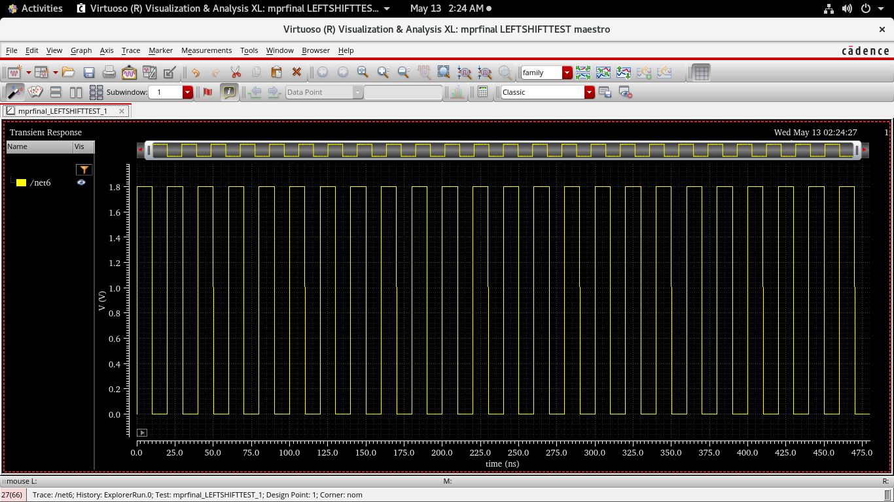
  <figcaption>Clock Signal — 20 ns period, 50% duty cycle</figcaption>
</figure>

<h4>2. Data:</h4>
<ul>
  <li>The data is sampled at the positive edge of the clock. Therefore, the data duration for one bit is equal to one complete clock cycle, i.e., <code>20 ns</code>.</li>
  <li>For example, if the input data is <code>10101010</code>, the ON time would be <code>20 ns</code> and the total cycle time would be <code>40 ns</code>. In this design, the input data used is <code>11111111</code>; therefore, the input behaves as a constant DC voltage of <code>1.8 V</code>, continuously representing logic 1.</li>
</ul>
<figure>
  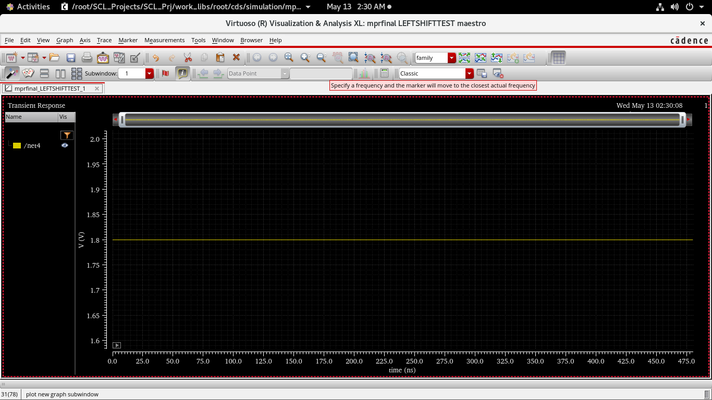
  <figcaption>Data Signal — constant 1.8 V for input 11111111</figcaption>
</figure>

<h4>3. Select:</h4>
<ul>
  <li>Initially, the SELECT signal is set to logic 1 to allow serial loading of all 8 bits into the SIPO register. Since each bit requires <code>20 ns</code>, the total loading time is:
    
8 × 20 = 160 ns

    For proper setup timing, the SELECT signal is kept high for <code>159 ns</code>.
  </li>
  <li>After loading the data, the SELECT signal is changed to logic 0 to perform the left-shift operation. Since the data is shifted by 7 bits, seven zeros are inserted. Therefore, the required shifting time is:
    
7 × 20 = 140 ns

  </li>
</ul>
<figure>
  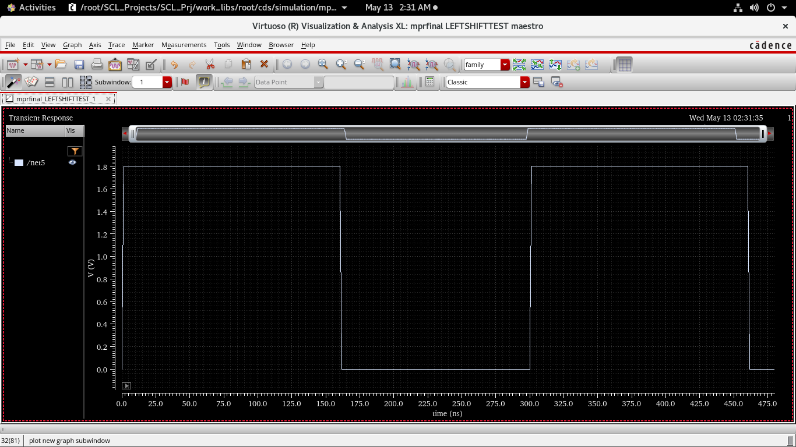
  <figcaption>SELECT Signal — high for 159 ns (load), then low for 140 ns (shift)</figcaption>
</figure>

<h4>4. ENABLE:</h4>
<ul>
  <li>During the initial loading and shifting operations, the PISO register should not load the data. Therefore, the ENABLE signal remains at logic 0 during this duration:
    
159 + 140 ≈ 300 ns

  </li>
  <li>Then for 8 clock cycles PISO would be ON and will give serial output. Therefore, the ENABLE signal remains at logic 1 during this duration:
    
8 × 20 = 160 ns

  </li>
  <li>After the shifted output becomes available, the LOADSTORE signal is changed to logic 0 for one clock cycle (<code>20 ns</code>) so that the PISO register can load the shifted data.</li>
  <li>Once the data is loaded, the PISO register returns to shift mode, and the LOADSTORE signal becomes logic 1 again.</li>
</ul>
<figure>
  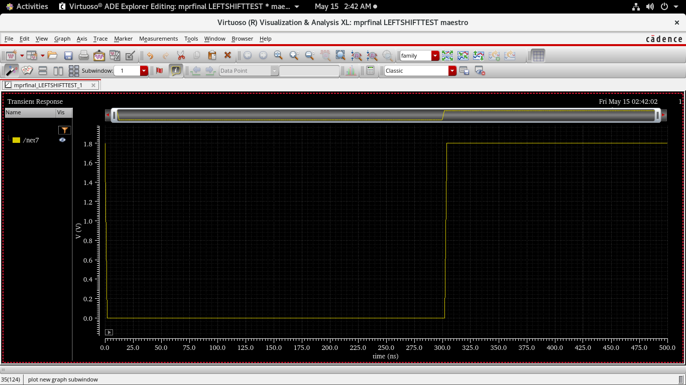
  <figcaption>ENABLE Signal — low for ~300 ns, then high for 160 ns</figcaption>
</figure>

<h4>5. LOADSTORE:</h4>
<ul>
  <li>During the initial loading and shifting operations, the PISO register should not load the data. Therefore, the LOADSTORE signal remains at logic 1 during this duration:
    
159 + 140 ≈ 300 ns + 20 ns (For setup time of ENABLE) = 320 ns

  </li>
  <li>After the shifted output becomes available, the LOADSTORE signal is changed to logic 0 for one clock cycle (<code>20 ns</code>) so that the PISO register can load the shifted data.</li>
  <li>Once the data is loaded, the PISO register returns to shift mode, and the LOADSTORE signal becomes logic 1 again.</li>
</ul>
<figure>
  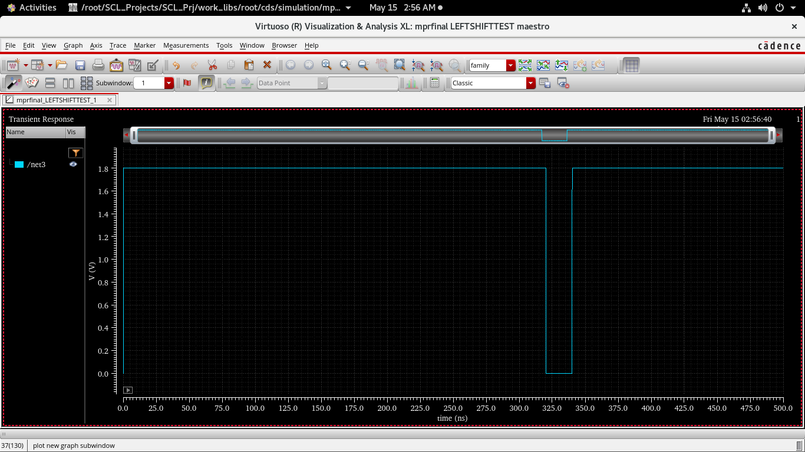
  <figcaption>LOADSTORE Signal — high for 320 ns, low pulse for 20 ns (load), then high again</figcaption>
</figure>

<h3>OVERALL TIMING DIAGRAM:</h3>
<figure>
  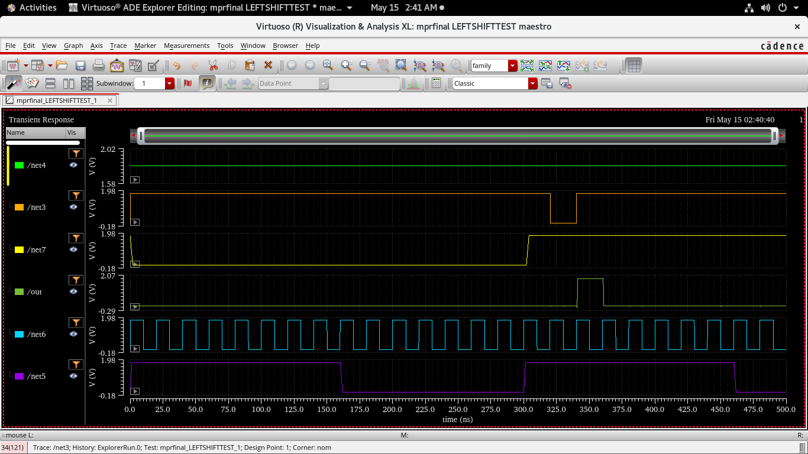
  <figcaption>Overall Timing Diagram — SELECT, LOADSTORE, ENABLE, OUT, CLK, Data signals</figcaption>
</figure>

<h3>7.3. Analysis time</h3>
<ul>
  <li>The total analysis time is calculated as:
    
320 + 170 = 490 ns

  </li>
  <li>Therefore, the simulation analysis time is taken as:
    
500 ns

  </li>
</ul>

<!-- 10 -->
<h2>10 | LAYOUT</h2>

<h3>PISO:</h3>
<figure>
  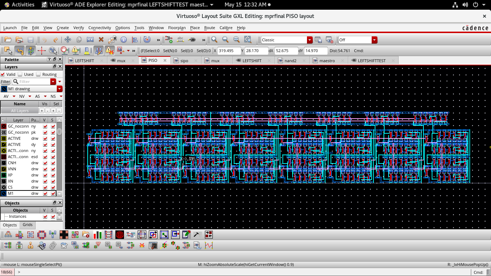
  <figcaption>PISO Layout — Cadence Virtuoso GXL</figcaption>
</figure>

<h3>SIPO:</h3>
<figure>
  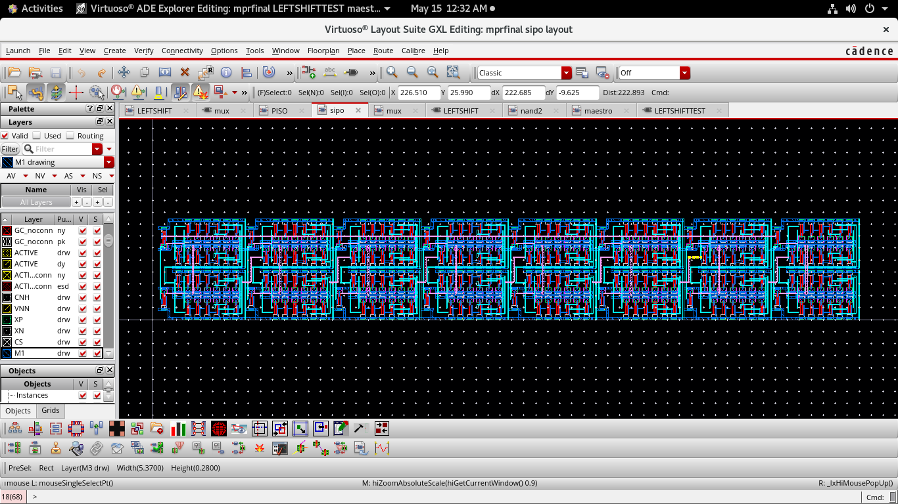
  <figcaption>SIPO Layout — Cadence Virtuoso GXL</figcaption>
</figure>

<h3>FINAL LAYOUT:</h3>
<figure>
  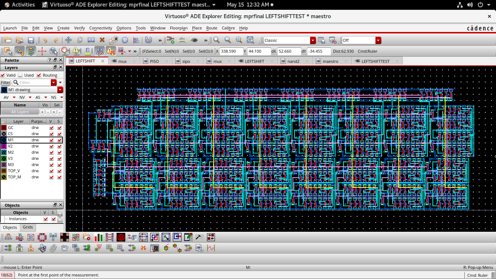
  <figcaption>Final Complete Layout — 8-bit Left Shift Register</figcaption>
</figure>

<h3>LAYOUT BREAKDOWN:</h3>
<figure>
  
  <figcaption>Layout Breakdown — PISO (top), MUX (left), SIPO (bottom) regions annotated</figcaption>
</figure>

<!-- 11 -->
<h2>11 | AREA ANALYSIS</h2>

<strong>Height = 98.85 µm</strong>

<strong>Width = 316.06 µm</strong>

 

<strong>Area = Height × Width</strong>

<strong>Area = 98.85 µm × 316.06 µm</strong>

<strong>Area = 3.124 × 104 µm²</strong>

<!-- 12 -->
<h2>12 | POST LAYOUT &amp; PRE LAYOUT COMPARISION</h2>
<ul>
  <li>Delay added due to parasitic capacitance &amp; resistance: 0.5003 ns</li>
  <li>Pre Layout delay = 0.74 ns</li>
  <li>Post Layout delay = 0.74 + 0.5003 = 1.2407 ns</li>
</ul>

<h3>12.1. Post Layout Power Analysis</h3>
<table>
  <tr><th>Parameter</th><th>Symbol</th><th>Value</th><th>Unit</th></tr>
  <tr><td>Average Current</td><td>Iavg</td><td>103.2</td><td>µA</td></tr>
  <tr><td>Peak Current</td><td>Ipeak</td><td>3.616</td><td>mA</td></tr>
  <tr><td>Average Power</td><td>Pavg</td><td>185.76</td><td>µW</td></tr>
</table>
<ul><li><strong>Average Power Consumption:</strong></li></ul>

Average Power = VDD × Iavg

Average Power = 1.8 V × 103.2 µA

Average Power = 185.76 µW

<ul><li><strong>Energy Consumption:</strong></li></ul>

Energy = Tsim × Pavg

Energy = 500 ns × 185.76 µW

Energy = 92.88 µJ

</body>
</html>
